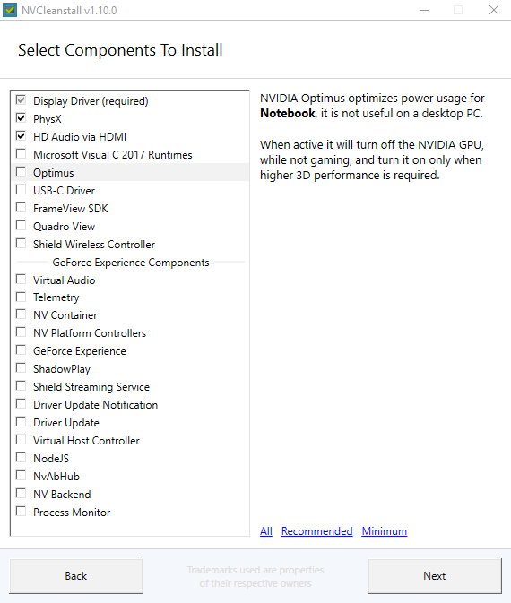

# Guides

You can use these guides for setting up a new or an old installations of windows, I do not believe in running random scripts on my personal computer hence there won't be any links to any scripts that "makes your pc faster".

I also use a microsoft account as it is used in my way of work so no privacy focused tweaks, for that you will have to do your own research. 

That being said understand each step and proceed cautiously especially the hardware manipulation part. As this is a written guide, read all the steps before starting to do anything.

All the links of the softwares used are in the softwares page

I am not responsible for bricking your pc. Follow these at your own risks

Cheers!

# Contents
- [Setting up WIndows]
- [Undervolting and Underclocking for laptops]
- [Customization]
- [MSI laptops]

## 
#

I will assume you have an installed windows 10 home or pro pc, with your desired partitions laid out. There isnt anything to tweak in those.

- ## First time boot up
    - Remove Bloatware/ Uninstall using Hibit Portable
        - OneDrive
        #### On Tools >> Windows Store Apps Manager
        - 3D Viewer
        - Alarms and Clock
        - Cortana 
        - Get Help
        - HEIF Image Extensions
        - Maps
        - Microsoft Pay
        - Microsoft Solitare Collection 
        - Mixed Reality Portal
        - Movies and TV 
        - Office
        - OneNote
        - Paint 3D
        - People 
        - Photos
        - Skype
        - Sticky Notes
        - Tips 
        - Voice Recorder
        - VP9 Video Extensions
        - Weather
        - Web Media Extensions 
        - Webp Image Extensions
        - Your Phone

    #### From Start Menu
        - Microsoft News

- ## Drivers
    - ### Nvidia
        - Use NVCleanInstall
        - Manually select driver version, choose your preferred driver version and platform

            >For desktops
            

            >For laptops
            

        - If you want geforce experience/shadowplay select he modules or download your drivers from the official website

        - Some laptops require the usb-c module for the optimus to work, Turing and above. 

        - These remove the bloat that is installed with nvidia drivers and the background services
        
    - ### AMD/Intel

        - I haven't have had any device from AMD but the general consensus is to use the official installer

        - Intel Update Assistant is preferred. Install it, upgrade your drivers and uninstall it

## Performance and Temps 
#

- [CPU](#cpu) 
- [GPU](#gpu)
- [Misc](#misc)

### CPU 

Program Used : Throttlestop

I will only be listing out the profiles and some additional info. Read the in-depth guide for a better understanding.

Enable SpeedShift if you have the option in your bios.

[A more in-depth guide](https://www.ultrabookreview.com/31385-the-throttlestop-guide/)

>    These are just an example of my undervolt, yours might vary, **DO NOT COPY**
>    - Undervolt
>        - Core :  -125mv
>        - Cache : -120mv
>        - igpu unslice  : -100mv
>        - intel gpu : -100mv

For stress test use the throttlestop bench option, if there is a singlt error on MAX size, change your undervolt

- 4 Profiles, Performance, No-Boost, Quiet, Battery

> ### For auto-switching to battery profile
> 

### For games/programs that require higher clocks
> - Performance
>    - SpeedShift - 32
>    - 3.6 Multiplier all cores
    
### If you want to play and be on lower temps
> - No-Boost
>    - SpeedShift - 32
>    - Boost off

### Browsing/Office Work
> - Quiet
>    - SpeedShift - 192
>    - Boost off

### For the last 20% of your battery
> - Battery
>    - SpeedShift - 255
>    - Boost off

### GPU

#### Mostly for reducing laptop temps

- Find out your max rated clock on the internet for your gpu

- Using msi afterburner set the frequency curve to the frequency found above

As an example, max clock of my 1660ti mobile is rated at 1.59GHz. So I locked it to 1600MHz

> Use shift + drag to select all points in the curve, select any one point, shift + enter and input the frequency

> Do not run Afterburner on start up on laptops, it will constantly ping the dgpu and reduce battery life

### Misc

- ISLC
    - Used for routinely clearing out cached ram
    - Helps with reducing stutters in some games

    