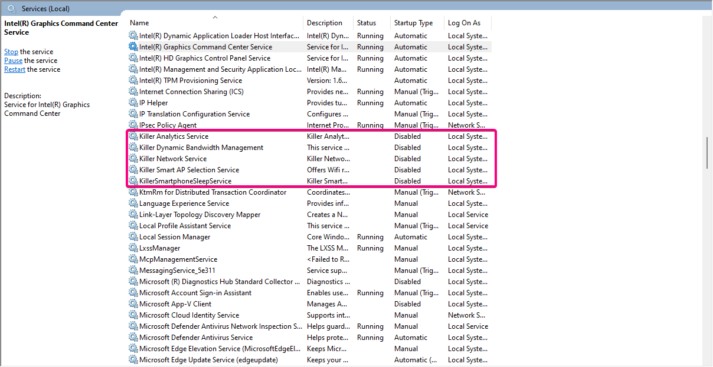
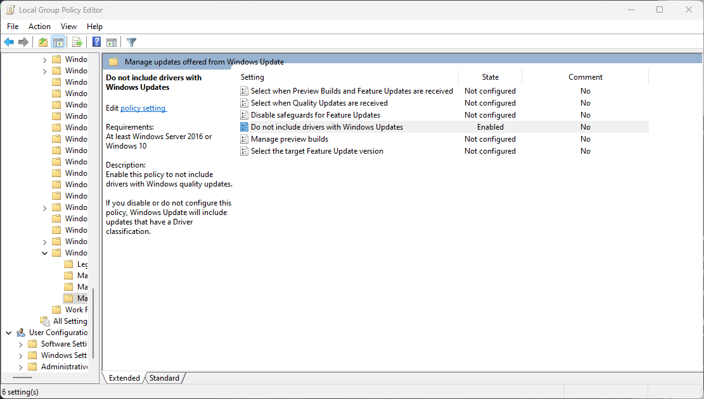
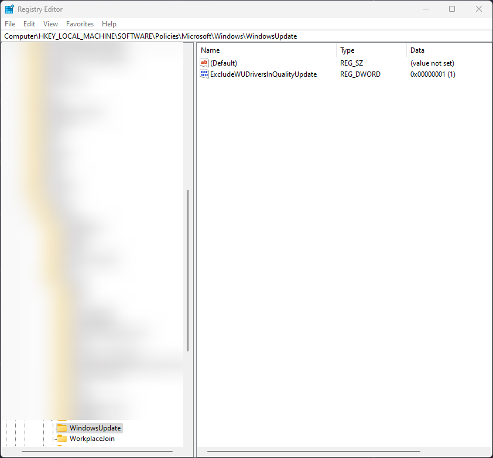
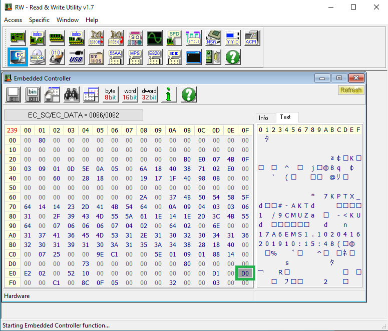

# Some specific tips for MSI Laptops

My laptop is MSI GS65 2019

- i7-9750h
- 1660ti
- 16GB 2666 Mhz

These are some of my pains and tricks I have with specifically this laptop/MSI in general

## --> Killer Networking

For people with Killer Networking, quite a lot of unnecessary services are enabled and running. Disable these on the Services app

> xTendSoftAPService &nbsp;&nbsp;&nbsp;&nbsp;&nbsp;&nbsp; xTendUtilityService

    -If you have any problems, enable the Killer Networking Service, rest are bloatware.

&nbsp;

---

## --> Nahimic

For people having low microphone volume issues, this might be highly related to the Nahimic Bloatware bundled with Realtek drivers in windows update

To stop this we just disable driver updates from windows updates itself, it does mean you will have to update some drivers yourself but I only update Intel/Nvidia drivers so it's not a huge effort.

**Using Gpedit.msc :**

    Computer Configuration -> Administrative Templates -> Windows Components -> Windows Update -> Manage Updates offered from Windows Update

    “Do not include drivers with Windows Updates” -> Click Enabled -> Apply -> OK

    
    
**Using Regedit :**

    Go to HKEY_LOCAL_MACHINE\SOFTWARE\Policies\Microsoft\Windows

    Right-click Windows and choose New -> Key. Name the new key WindowsUpdate

    Right-click WindowsUpdate and click New -> DWORD (32-bit) Value.

    Name the new value as ExcludeWUDriversInQualityUpdate. Double-click it and set its value to 1

 

&nbsp;

---

## --> Battery Limiter without Dragon Center

[RWEverything](http://rweverything.com/downloads/RwPortableX64V1.7.zip)

    If you have a similar aversion to using Dragon Center but also want to limit your battery charging limit
    Change the highlighted value to the following for the percentages limit
     BC -  60%
     D0 -  80%
     E4 -  100%

